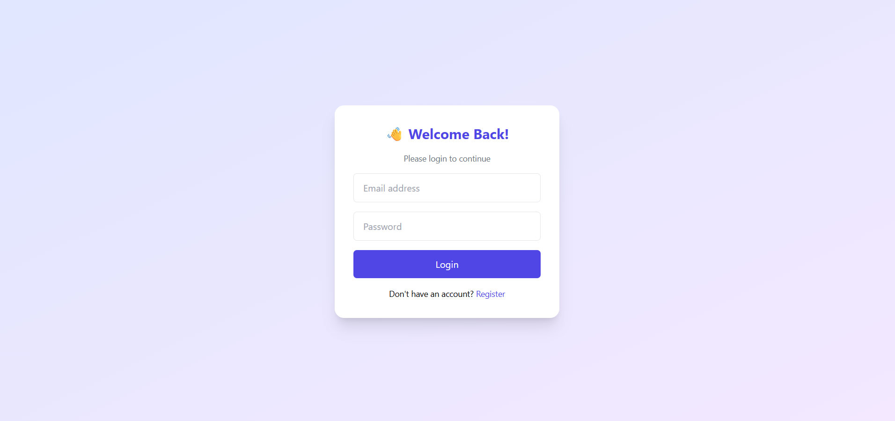
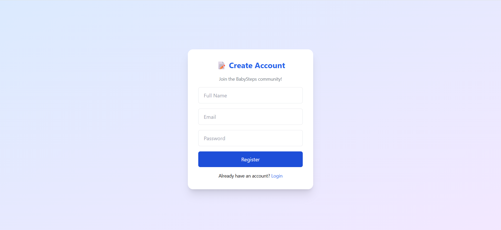
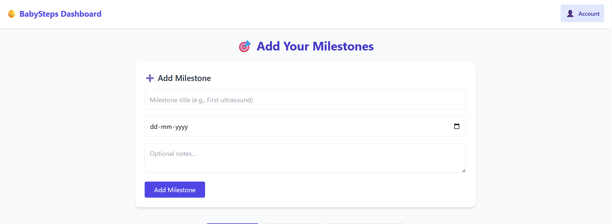
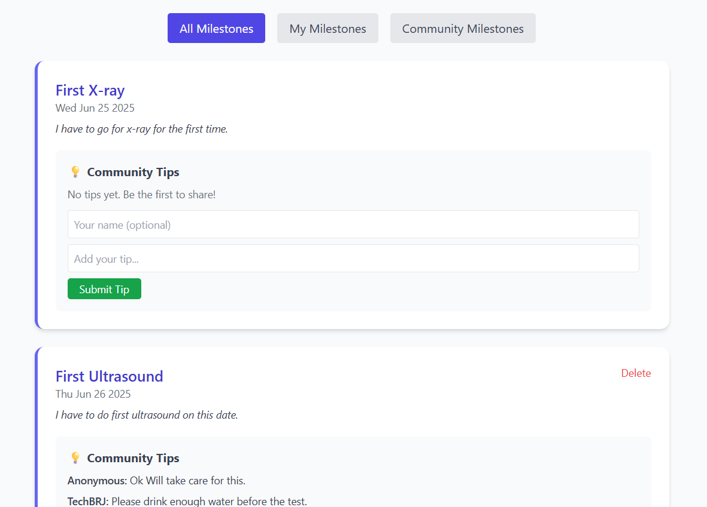

# 👶 BabySteps: Milestone Tracker & Community Tips

BabySteps is a full-stack MERN (MongoDB, Express.js, React.js, Node.js) web application that helps users log and track baby milestones, while also engaging with a community to share and receive helpful tips.

## 🚀 Features

- ✅ User Registration & Login (JWT Auth)
- 🧠 Create, view, and delete **Milestones**
- 💬 View & submit **Community Tips** on each milestone
- 🔍 Filter milestones: All | My Milestones | Community
- 💻 Responsive and Modern UI (TailwindCSS)
- 🎯 Role-based functionality (only owners can delete milestones)
- ⏳ Loading indicators (spinners for login, tips, and milestone creation)
- 🛡 Protected routes and token-based authentication

---

## 🛠️ Prerequisites

Make sure the following are installed on your machine:

- **Node.js** (v16+)
- **MongoDB Atlas** (with an active cluster)
- **Firebase Project** (for client-side authentication)
- **.env** file configured properly (see `.env.example`)
- (Optional) **Postman** to test API endpoints

---

## 🚀 How to Run This Project

### 1. Clone the Repository

- git clone https://github.com/riteshd541/babysteps-assignment.git

### 2. Install Dependencies

#### Backend

- cd backend
- npm install

#### Frontend

- cd frontend
- npm install

## 🧪 Environment Variables

Create a `.env` file in the `server` directory:

```env
MONGO_URI=your_mongodb_connection_string
JWT_SECRET=your_secret_key
PORT=5000
```

### 4. Start the App

#### Start Backend Server

- cd backend
- npm start

#### Start Frontend Dev Server

- cd ../frontend
- npm start

---


## 🏗 Tech Stack

### Frontend:
- React.js
- Tailwind CSS
- React Router DOM
- Axios

### Backend:
- Node.js
- Express.js
- MongoDB (via Mongoose)
- JSON Web Token (JWT) for auth

---

---


## 💡 How It Works
- User signs up / logs in (JWT stored in localStorage)
- User can add milestones with title, date, and notes
- All milestones are visible — filtered by All / My / Community
- Each milestone can have community-contributed tips
- Logged-in users can share tips (their name is auto-filled)
- Delete option only shown for milestones created by logged-in user

## 📸 Screenshots

### Login  Page


### Register Page


### Dashboard (Add Milestone)


### All Milestone


### Self Milestone

